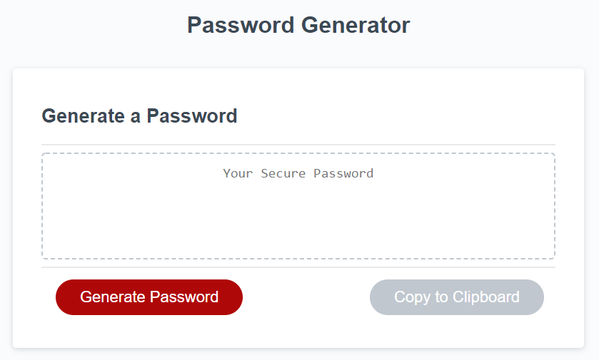

# Unit 03 JavaScript Homework: Password Generator

## Installation

An application that generates a random password based on user-selected criteria. This app will run in the browser and feature dynamically updated HTML and CSS powered by JavaScript code.

[PasswordGenerator](https://comp7589.github.io/PasswordGenerator/)

## Usage

The user will be prompted to choose from the following password criteria:

* Length (must be between 8 and 128 characters)

* Character type:

  * Special characters

  * Numeric characters

  * Lowercase characters

  * Uppercase characters

The application validates user input and ensures that at least one character type is selected.

Once all prompts are answered, the user will be presented with a password matching the answered prompts. Displaying the generated password in an alert is acceptable, but attempt to write the password to the page instead.

As a bonus, the user should also have the option to click a button to copy the password to their clipboard.

Your application should have a clean and polished user interface and be responsive, ensuring that it adapts to multiple screen sizes.

Your application should be deployed to GitHub Pages.

Your application's GitHub repository should contain a README.md file explaining the purpose and functionality of the application. The README.md file should include a screenshot of the completed application as well as a link to the deployed GitHub Pages URL.

## User Story

AS AN employee with access to sensitive data

I WANT to randomly generate a password that meets certain criteria

SO THAT I can create a strong password that provides greater security

## Business Context

For companies that handle large amounts of sensitive data, weak passwords can pose a real security threat. An application that can generate strong passwords quickly and effortlessly saves employees time and ensures secure access to data.

## Credits

I, Ryan Compton, am the sole collaborator on this assignment. 

## License

Copyright &copy; All rights reserved.

Licensed under the [MIT](https://choosealicense.com/licenses/mit/) license.